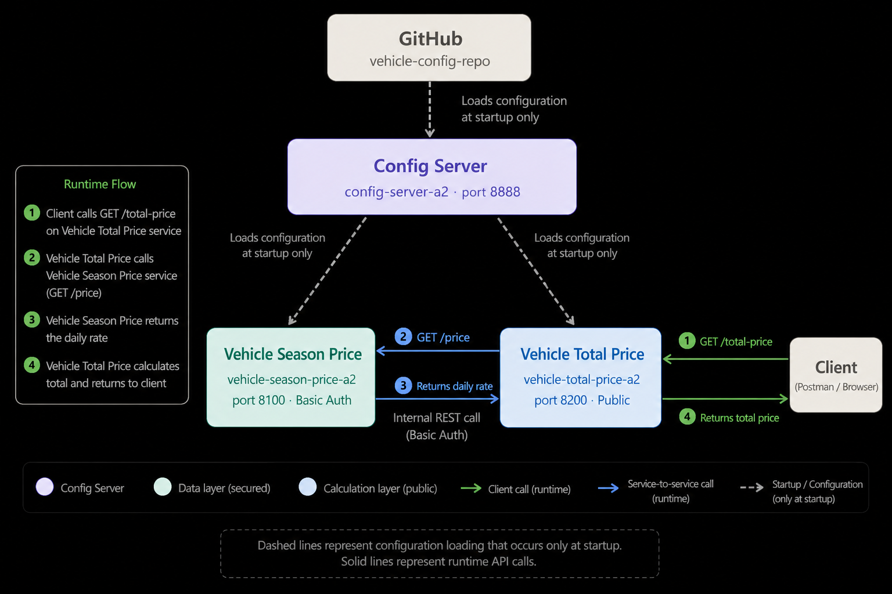

# Vehicle Rental Price Calculation System

**CCCS-425-764 Web Services — Assignment 2**
McGill University — School of Continuing Studies
Brad Cibula — July 2026

---

## Overview

A microservices-based vehicle rental price calculation system built with Spring Boot 4.1.0 and Spring Cloud. The system retrieves daily rental rates for vehicles by season and calculates total rental costs for a given number of days.

---

## Repository Structure

```
vehicle-rental-a2/
├── config-server-a2/           # Spring Cloud Config Server (port 8888)
├── vehicle-season-price-a2/    # Vehicle Season Price microservice (port 8100)
├── vehicle-total-price-a2/     # Vehicle Total Price microservice (port 8200)
├── vehicle-config-repo/        # Centralized configuration properties
├── a2-architecture-diagram.png # System architecture diagram
└── Assignment2_Vehicle_Rental_Documentation_BRAD_CIBULA.pdf
```

---

## Prerequisites

- Java 17
- Maven 3.x
- IntelliJ IDEA (or any Java IDE)
- Internet connection (Config Server pulls from GitHub)

---

## Startup Order

Services must be started in this exact order:

| Step | Service | Port |
|------|---------|------|
| 1 | config-server-a2 | 8888 |
| 2 | vehicle-season-price-a2 | 8100 |
| 3 | vehicle-total-price-a2 | 8200 |

Open each project in IntelliJ by pointing at its subfolder `pom.xml`. Allow Maven to finish importing before starting.

---

## Endpoints

### Vehicle Season Price — `http://localhost:8100`
Requires Basic Authentication: `rental` / `rental123`

```
GET /price?vehicle=SUV&season=Summer
```

Example response:
```json
{
  "vehicle": "SUV",
  "season": "Summer",
  "dailyRate": 70,
  "port": "8100"
}
```

### Vehicle Total Price — `http://localhost:8200`
No authentication required.

```
GET /total-price?vehicle=SUV&season=Winter&days=10
```

Example response:
```json
{
  "vehicle": "SUV",
  "season": "Winter",
  "days": 10,
  "dailyRate": 60,
  "totalPrice": 600,
  "port": "8200"
}
```

---

## Vehicle Types

`Compact` · `Sedan` · `SUV` · `Convertible` · `Truck`

## Seasons

`Spring` · `Summer` · `Fall` · `Winter`

> Input is case-insensitive — `suv`, `SUV`, and `Suv` all return the same result.

---

## Architecture



---

## Documentation

Full API documentation, setup instructions, and design decisions are available in the PDF included in this repository.
